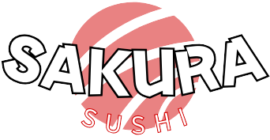

#  🌸 Sakura Sushi 🌸 - Cardápio Online

<p align="center">
  
</p>

Bem-vindo ao projeto do cardápio online do Sakura Sushi! Este site foi desenvolvido para permitir que os usuários visualizem de forma clara e atraente os diversos pratos oferecidos pelo restaurante, incluindo entradas, pratos quentes, combinados, sushis e sashimis.

## Índice

*   [Sobre o Projeto](#sobre-o-projeto)
*   [Tecnologias Utilizadas](#tecnologias-utilizadas)
*   [Funcionalidades Implementadas](#funcionalidades-implementadas)
*   [Como Executar o Projeto Localmente](#como-executar-o-projeto-localmente)
*   [Estrutura do Projeto](#estrutura-do-projeto)
*   [Contato](#contato)

## Sobre o Projeto

O objetivo principal deste projeto é criar uma experiência digital agradável e intuitiva para os clientes do Sakura Sushi, facilitando a exploração do cardápio. O design busca ser moderno, minimalista e alinhado com a identidade visual do restaurante, destacando a qualidade dos pratos através de imagens e informações claras.

## Tecnologias Utilizadas

Este projeto foi construído utilizando as seguintes tecnologias front-end:

*   *HTML5:* Para a estrutura semântica do conteúdo.
*   *CSS3:* Para estilização e layout, incluindo:
    *   Flexbox para organização dos elementos.
    *   Animações e transições CSS para interatividade (ex: hover nos cards, aparição do carrinho).
*   *Font Awesome:* Para ícones vetoriais (estrelas de avaliação, carrinho de compras, ícones de redes sociais).

## Funcionalidades Implementadas

*   *Visualização do Cardápio Interativo:*
    *   Navegação local entre as seções do cardápio: Home, Entradas, Pratos Quentes, Combinados, Sushis & Sashimis.
    *   Exibição de cada prato em um card individual e informativo.
*   *Detalhes nos Cards de Produto:*
    *   Imagem de alta qualidade para cada prato.
    *   Nome do prato.
    *   Sistema de avaliação visual por estrelas (suportando estrelas cheias, vazias e meia estrela).
    *   Preço do prato.
*   *Interatividade do Usuário:*
    *   Efeito de hover nos cards de produto, revelando um botão estilizado para "adicionar ao carrinho".
*   *Design e Layout:*
    *   Cabeçalho fixo para acesso constante à navegação principal.
    *   Rodapé informativo com detalhes de endereço (fictício) e links para redes sociais(não funcionais).

## Como Executar o Projeto Localmente

Para visualizar este projeto em sua máquina local:

1.  *Clone o repositório (se estiver hospedado no GitHub, GitLab, etc.):*

       ```text
    git clone https://lorena-rinaldo.github.io/Adivinhe-o-Numero/
    ```
    
     ```text
    cd Adivinhe-o-Numero
     ```
    
    Se você já possui os arquivos localmente, pode pular esta etapa.

3.  **Abra o arquivo index.html:**
    *   Navegue até a pasta raiz do projeto no seu explorador de arquivos.
    *   Abra o arquivo index.html em qualquer navegador web moderno (como Google Chrome, Firefox, Edge).

## Estrutura do Projeto
```text
A estrutura de arquivos e pastas do projeto está organizada da seguinte forma:

.
├── assets/
│   ├── favIcon.ico
│   ├── videoInicial.mp4
│   ├── carpaccioDeSalmao.png
│   ├── edamame.png
│   ├── gohanComDonburiDeFrango.png
│   ├── guioza.png
│   ├── gunkanDeSalmãoComOvas.png
│   ├── harumaki.png
│   ├── hossomakiDePepino.png
│   ├── hotRoll.png
│   ├── cervejaJaponesa.png
│   ├── saque.png
│   ├── umeshu.png
│   ├── shochu.png
│   ├── japaneseWhiskyHighball.png
│   ├── chaVerdeJapones.png
│   ├── ramune.png
│   ├── calpico.png   
│   ├── jowDeCamarao.png
│   ├── katsuCurry.png
│   ├── lamen.png
│   ├── logo_invertida.png     
│   ├── logo_principal.png      
│   ├── niguiriDeVieira.png
│   ├── robata.png
│   ├── sashimiDeBarrigaDeSalmao.png
│   ├── sashimiDePolvo.png
│   ├── shimejiNaManteiga.png
│   ├── sukiyaki.png
│   ├── sunomono.png
│   ├── temakiCalifornia.png
│   ├── tempuraDeLegumes.png
│   ├── teppanyaki.png
│   ├── tunaTataki.png
│   ├── uramakiFiladelfia.png
│   └── yakissoba.png
├── index.html               
├── style.css                  
└── README.md                  
```
## Contato

Desenvolvido por: *Lorena Rinaldo Moreira*

*   GitHub: https://github.com/Lorena-Rinaldo
*   LinkedIn: www.linkedin.com/in/lorena-rinaldo01
*   Email: lorena.rinaldodev@gmail.com

---

🥢 Desfrute do cardápio virtual do Sakura Sushi! 🍣
